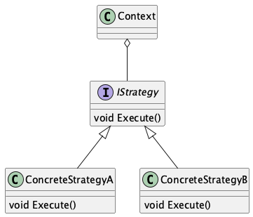
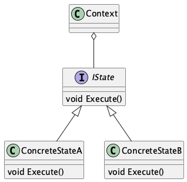
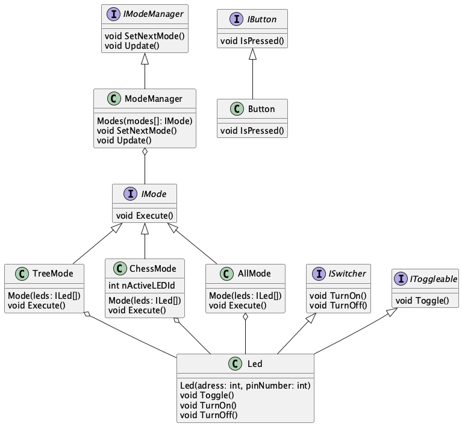
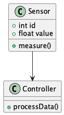
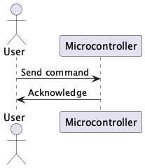
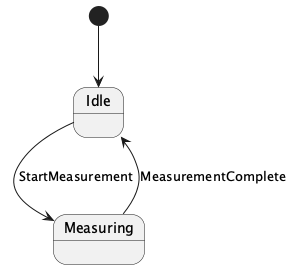
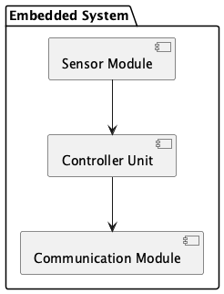
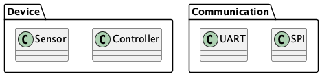
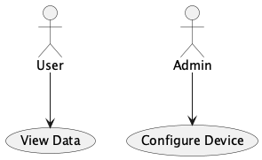
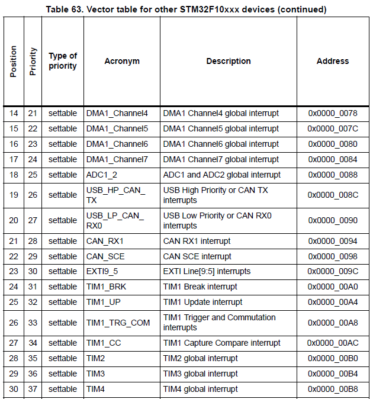

= Отчет №3 - Прерывания, таймеры
:toc:
:toc-title: Оглавление
:toclevels: 3
:sectnums:
:sectnumlevels: 3
:icons: font
:source-highlighter: coderay
:figure-caption: Рисунок

include::title.adoc[]

== Цель

Цель - понять, зачем нужны прерывания, NVIC, таблица векторов прерываний.

== Использование шаблонов проектирования

Шаблон проектирования — это типовое, проверенное решение часто встречающейся проблемы в разработке программного обеспечения. Он не является готовым кодом, а представляет собой общую концепцию или подход, который можно адаптировать под конкретную задачу.

=== Стратегия (Strategy)

Позволяет выбирать алгоритм поведения во время выполнения программы.

.Диаграмма шаблона "Стратегия"

=== Состояние (State)

Позволяет объекту менять своё поведение в зависимости от внутреннего состояния.

.Диаграмма шаблона "Состояние"

== Структура проекта

Проект организован модульно, что упрощает поддержку и расширение.

.Диаграмма структуры проекта

== Как работают прерывания, какие они бывают, что происходит при их возникновении?

*Прерывания* — это механизм, с помощью которого микроконтроллер может реагировать на внешние или внутренние события, приостанавливая основную программу и переходя к выполнению обработчика прерывания.

=== Типы прерываний:

* Внешние: от внешних устройств (например, кнопка, сенсор).
* Внутренние: от периферии микроконтроллера (таймеры, АЦП, UART и т.д.).
* Системные: например, системный таймер SysTick (для генерации регулярных интервалов).

=== Что происходит при прерывании:

* Выполняемая инструкция приостанавливается.
* Адрес текущей инструкции сохраняется.
* Переход к обработчику прерывания (адрес берется из таблицы векторов прерываний).
* После завершения обработчика выполнение основной программы продолжается.

== PlantUML

PlantUML — это инструмент для создания диаграмм с помощью простого текстового описания, без использования графического интерфейса.
 
=== Что может делать PlantUML:

.Диаграмма классов

.Диаграмма последовательности

.Диаграмма состояний

.Диаграмма компонентов

.Диаграмма пакетов

.Диаграмма прецедентов

== Принципы SOLID

=== Принцип единственной ответственности (SRP)

* Каждый класс должен отвечать только за одну операцию.

=== Принцип инверсии зависимостей (DIP)

* Модули верхнего уровня не должны зависеть от модулей нижнего уровня. И те, и другие должны зависеть от абстракций. Абстракции не должны зависеть от деталей. Детали должны зависеть от абстракций.

== Контроллер прерываний NVIC

*NVIC (Nested Vectored Interrupt Controller)* — это контроллер прерываний, встроенный в ядро ARM Cortex-M.

=== Функции NVIC:

* Приоритизация прерываний (можно настроить приоритеты).
* Маскирование/разрешение отдельных прерываний.
* Быстрое переключение между прерываниями.
* Поддержка вложенных прерываний (одно прерывание может прерываться другим, если у второго выше приоритет).

== Что такое таблица векторов прерываний?

*Таблица векторов прерываний* — это массив указателей (адресов) на функции-обработчики прерываний. Она находится в начале памяти и содержит:

* Адрес начала стека.
* Адрес обработчиков для Reset, NMI, HardFault и далее всех других прерываний.

:figure-caption: Рисунок

.Таблица векторов прерываний

== Что такое обработчик прерываний и как правильно его писать?

*Обработчик прерываний (ISR, Interrupt Service Routine)* — это функция, которая вызывается, когда возникает прерывание.

*Основные правила:*

* Обязательно сбрасывать флаг прерывания внутри обработчика.
* Обработчик должен быть как можно короче — минимум логики.
* В обработчике не вызывать тяжелые функции (printf и т.д.).

== Обработать событие по переполнению таймера 2 через прерывание. Как это происходит?

*TIM2* — это 32-битный таймер общего назначения. Он может сгенерировать прерывание по переполнению (если счетчик достигнет значения в ARR и обнулится).

=== *Настройка таймера TIM2:*

* Подать тактирование на модуль TIM2 (через `RCC->APB1ENR |= RCC_APB1ENR_TIM2EN`).
* Установить делитель (`PSC`) и автоперезагрузку (`ARR`) для задания интервала.
* Включить прерывание по переполнению (`TIM2->DIER |= TIM_DIER_UIE`).
* Сбросить флаг UIF (`TIM2->SR &= ~TIM_SR_UIF`).
* Включить таймер (`TIM2->CR1 |= TIM_CR1_CEN`).
* Включить прерывание в NVIC (`NVIC_EnableIRQ(TIM2_IRQn)`).

=== *Когда счетчик достигает значения в ARR:*

* Счетчик обнуляется.
* Устанавливается флаг UIF.
* Генерируется прерывание.
* NVIC вызывает TIM2_IRQHandler.

== Вывод по отчету

В ходе работы я изучил принципы обработки прерываний в микроконтроллерах, включая их классификацию и механизм работы. Рассмотрел особенности контроллера прерываний NVIC и структура таблицы векторов прерываний. На примере таймера TIM2 разобрана практическая реализация обработки прерываний, включая настройку оборудования и написание корректных обработчиков. 